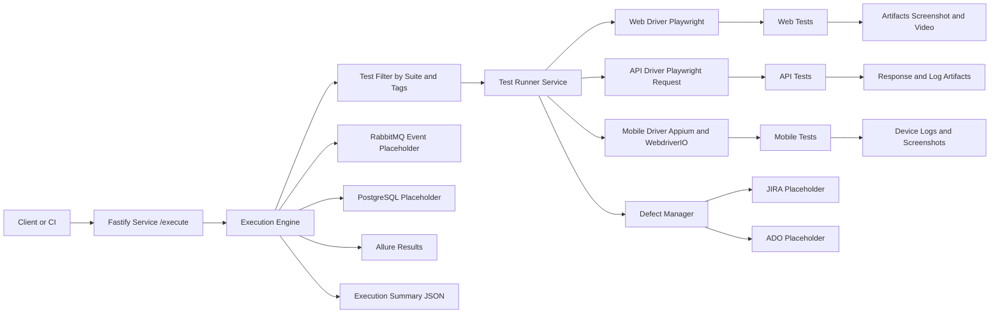
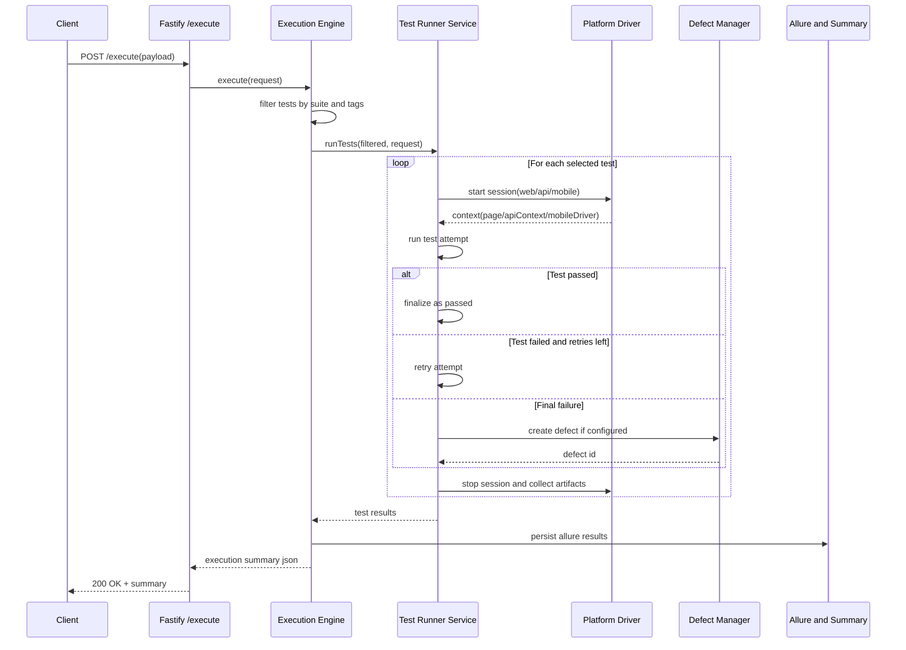

# Cognitest Engine Technical Documentation

This document explains how the framework is structured, how execution flows internally, and where to extend it for enterprise scale.

{: .warning }
Treat integration sections as extension contracts. Validate authentication, rate limits, and payload schemas before production rollout.

## Quick Navigation

- Platform capabilities and architecture: sections 1 and 2
- Module-level design: sections 3 and 4
- Integration contracts: section 5
- Runtime and deployment model: sections 8 and 9
- Request-to-result deep walkthrough: section 13
- Role-based technical path: section 14

## 1. Overview

Cognitest Engine is a hybrid test automation execution service built with Node.js and TypeScript.  
It supports:

- Web automation using Playwright browser APIs
- API automation using Playwright request APIs
- Native mobile automation using Appium + WebdriverIO
- Execution via REST API
- Data-driven and tag-driven test filtering
- Defect automation placeholders for JIRA and Azure DevOps
- Allure-ready output artifacts
- Container and Kubernetes deployment

This platform is cloud-agnostic and designed to evolve into a distributed AI-powered low-code test automation platform.

## 2. High-Level Architecture

The current architecture follows a service-oriented execution model:

1. Fastify microservice receives execution request
2. Execution engine filters tests by suite/tags
3. Test runner executes tests in parallel with retry/fail-fast controls
4. Drivers initialize platform-specific sessions (web/api/mobile)
5. Result aggregator generates execution summary and artifacts
6. Integration layer handles defect, event, and database placeholders
7. Output is returned as JSON and persisted for reporting



## 3. Source Structure

```text
src/
├── core/
│   ├── drivers/
│   ├── core-actions.ts
│   ├── base-test.ts
│   └── locator-healing.ts
├── components/
│   ├── web/
│   ├── api/
│   └── mobile/
├── tests/
│   ├── web/
│   ├── api/
│   └── mobile/
├── data/
│   ├── readers/
│   └── faker-utils.ts
├── config/
├── integrations/
├── ai_agents/
├── utils/
├── execution/
└── main.ts
```

## 4. Core Modules

### 4.1 Service Layer

- `src/main.ts`
  - Exposes `/health` and `/execute`
  - Accepts execution payload
  - Runs execution and returns summary JSON

Execution payload:

```json
{
  "suite": "smoke",
  "env": "staging",
  "tags": ["login", "checkout"],
  "parallelism": 2,
  "retries": 1,
  "failFast": false,
  "defectProvider": "none"
}
```

### 4.2 Execution Layer

- `execution/execution-engine.ts`
  - Test discovery registry
  - Suite/tag filtering
  - Defect attachment
  - Allure result persistence
  - RabbitMQ event publishing placeholder

- `execution/test-runner-service.ts`
  - Parallel workers
  - Retry analyzer behavior
  - Fail-fast stop logic
  - Platform context initialization
  - Screenshot and video handling
  - Infra-aware skip conversion for missing Playwright/Appium runtime

### 4.3 Driver Layer

- `core/drivers/web-driver.ts`
  - Launches Chromium context
  - Enables video recording per run
- `core/drivers/api-driver.ts`
  - Creates Playwright API request context
- `core/drivers/mobile-driver.ts`
  - Creates WebdriverIO remote session against Appium

### 4.4 Test Abstractions

- `core/base-test.ts`
  - `HybridTestCase` interface
  - Standardized context per platform
  - Result factory
- `core/core-actions.ts`
  - Action wrappers
  - Accessibility execution via axe-core
- `core/locator-healing.ts`
  - Fallback selector resolution
  - DOM similarity placeholder for future self-healing

### 4.5 Web vs API vs Mobile Comparison

| Dimension | Web Automation | API Automation | Mobile Automation |
|---|---|---|---|
| Platform value | Validates browser UI and UX flows | Validates service behavior and contract | Validates native app behavior on devices |
| Test folder | `src/tests/web/` | `src/tests/api/` | `src/tests/mobile/` |
| Component folder | `src/components/web/` | `src/components/api/` | `src/components/mobile/` |
| Driver | Playwright browser/page | Playwright request context | Appium + WebdriverIO remote driver |
| Runtime context | `page` | `apiContext` | `mobileDriver` |
| Typical selector | CSS/XPath/role locator | Endpoint path and payload | Accessibility ID/resource ID/XPath |
| Startup dependency | Playwright browser binary | Network reachability of API endpoint | Appium server + emulator/device |
| Artifacts | Screenshot, video, logs | Response payload, logs | Screenshot/logs and device traces |
| Common bottleneck | Flaky locators, rendering timing | Test data state and auth tokens | Device availability and session stability |
| Primary use case | End-user journey validation | Fast service-level regression | Device-specific and native workflow checks |

## 5. Integrations

### 5.1 Defect Management

- `integrations/jira-client.ts`
- `integrations/ado-client.ts`
- `integrations/defect-manager.ts`

Current status:

- Placeholder create-bug operations
- Test ID and artifact paths mapped in payload-ready logs
- Designed for extension with real API tokens and project/work item mapping

### 5.2 Event Bus Placeholder

- `integrations/rabbitmq-client.ts`
  - Emits execution start/completion placeholders
  - Replace with `amqplib` producer channel for distributed orchestration

### 5.3 Database Placeholder

- `integrations/db-client.ts`
  - PostgreSQL connector placeholder using `pg`
  - Extend for run metadata persistence and query APIs

## 6. Data, Reporting, and Utilities

- Data readers: `data/readers/json-reader.ts`
- Synthetic test data: `data/faker-utils.ts`
- Visual regression utility: `utils/visual-regression.ts`
- Logging: `utils/logger.ts` with Winston JSON format
- Allure-ready output path: `reports/allure-results/`

## 7. Sample Tests

- Web: `tests/web/smoke-web.test.ts`
- API: `tests/api/smoke-api.test.ts`
- Mobile: `tests/mobile/smoke-mobile.test.ts`

These tests validate base engine behavior and demonstrate how to add new test cases.

## 8. Execution Modes

- Tag-based: runs tests matching any requested tag
- Suite-based: runs tests by suite name (`smoke`, `all`, etc.)
- Parallel: configurable worker count
- Retry: per-test retry count
- Fail-fast: optional stop after first failed test

### 8.1 Test Lifecycle Sequence



## 9. Deployment and DevOps

### 9.1 Local Runtime

- `npm run dev` to start service
- `npm run test` for direct sample execution

### 9.2 Docker

- Multi-stage Dockerfile
- Playwright base support
- Compose environment includes Appium, PostgreSQL, RabbitMQ

### 9.3 CI Templates

- Jenkins pipeline: `Jenkinsfile`
- Azure Pipeline: `azure-pipelines.yml`

### 9.4 Kubernetes

- Helm starter chart under `helm-chart/`
- Includes service and deployment templates
- Readiness and liveness probes configured

## 10. Security and Configuration

- Environment variables loaded via `config/env-loader.ts`
- Secrets manager contract: `utils/secrets-manager.interface.ts`
- Recommended next step: connect vault provider (Azure Key Vault, AWS Secrets Manager, HashiCorp Vault)

## 11. AI and Low-Code Readiness

Current contracts in `ai_agents/`:

- `testcase-generator.interface.ts`
- `testdata-generator.interface.ts`

These interfaces enable future plug-in AI agents for:

- Test case generation from requirements
- Synthetic dataset generation
- Autonomous healing and execution optimization

## 12. Technical Roadmap

1. Real connector implementation for JIRA/ADO with attachments and traceability
2. Distributed queue-based execution with RabbitMQ workers
3. Persistent run analytics with PostgreSQL schema
4. No-code orchestrator UI and workflow DSL
5. AI-assisted test authoring, healing, and root-cause analysis

## 13. Detailed Walkthrough (Request to Result)

### Phase 1: Client sends execution request

- Client or CI sends `POST /execute` with suite, tags, retries, and parallelism.
- Service validates payload and forwards request to execution engine.

### Phase 2: Engine resolves runnable test set

- Engine loads registered tests.
- Engine applies suite and tag filters.
- Engine builds run metadata and execution context.

### Phase 3: Runner executes tests with controls

- Runner starts platform driver per test (`web`, `api`, or `mobile`).
- Runner executes test body with retry policy.
- Runner applies fail-fast behavior when configured.
- Runner captures artifacts for failures and stores execution details.

### Phase 4: Integrations and reporting

- On final failure, defect manager route can create provider-specific defects.
- Engine writes Allure-compatible outputs into reporting path.
- Engine returns final summary JSON to service response.

### Phase 5: Consumer feedback loop

- CI consumes summary JSON for pass/fail gates.
- Teams inspect Allure artifacts for triage.
- Authors refine selectors, test data, and tags for stability and speed.

## 14. Role-Based Technical Paths

### Architect or Platform Owner

1. Start with sections 1 and 2 for capability and architecture boundaries.
2. Review sections 4 and 8 for execution behavior and control levers.
3. Use sections 10 and 12 for security planning and roadmap alignment.
4. Use section 13 to validate end-to-end architecture assumptions.

### Framework Maintainer

1. Focus on section 3 and section 4 for module ownership.
2. Use section 5 for integration extension points.
3. Validate runtime implications from section 9.
4. Use section 13 to trace failures from request to artifact generation.

### DevOps Engineer

1. Start at section 9 for runtime, container, and pipeline strategy.
2. Review section 8 for parallelism, retries, and fail-fast behavior.
3. Use section 10 for environment and secret handling expectations.
4. Use section 13 to map service interactions for observability setup.
